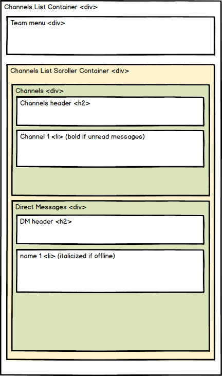
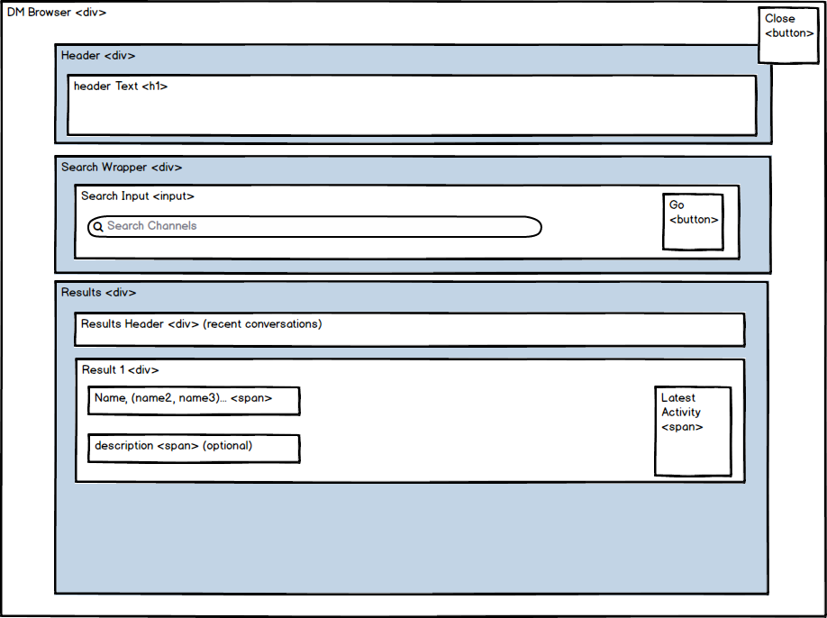
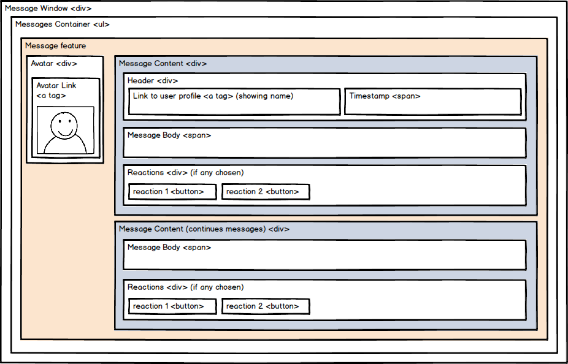

# **Sleek**

[Sleek live][link-to-sleek]
[link-to-sleek]: http://www.sleek-messaging.com

Sleek is a fullstack clone of Slack's web application.
It uses the following technologies:
* backend:
  + Ruby on Rails
  + PostgreSQL
* frontend:
  + ReactJS
  + Redux

## Features and Implementation
### Channels & Subscriptions
On the backend, all channels are represented by one channels table in the backend. This unifies the logic for public channels, private channels, and direct messages. To distinguish the channels' type, the table contains a `is_dm` column and a `private` column which are boolean and defaults to false.

Subscriptions are represented by a subscription table which is the associated join table. It contains an `id`, `user_id` and `channel_id` columns.

on the frontend, upon login, all of the User's subscriptions are pulled from the subscriptions API endpoint. The channels sidebar, represented by the ChannelSide component, contains a single subcomponent to render both channels and DM's, distinguishing based on their `is_dm` value.

#### Adding Channels
Adhering to Slack's UI, channel's and direct messages CRUD is done through modals.

Upon clicking on the channels or direct messages header, all available channels or users are listed. To provide a smoother experience, all available channels and users are pulled from the server upon login.

Fullscreen modals are stored in the state with a default state of `visible: false`. When activated, an action is called where the payload is a react component itself: `props.openModal(<Component />)`

### Messages
Messages are stored in a messages table, and are linked to channel by a `channel_id` foreign key.
Messages for each channel are pulled when a user moves channels. and are stored as a separate slice in the redux store.

in the frontend, each message is represented by a `MessageItem` component which has two subcomponents: `MessageAvatar` and `MessageContent`

using component state, user has the ability to edit his messages in the window.

#### Live Chat
To enable live chat, ReactPusher was used. Pusher is connected the messages `create` action and top the React message components and listens to changes. Whenever a new message is being dispatched pusher will update the channel to whomever listens to it.

## Future Features
In addition to the existing features, I plan on adding the following features:

### Reactions
Reaction are a very popular feature in Slack. I plan on adding this feature by using a database table dedicated to reactions and utilizing an existing react emoji library.

### Search
Adding the ability to search for messages, users and channels. I plan on implementing this feature using fuzzy search via the Fuse.js library.
